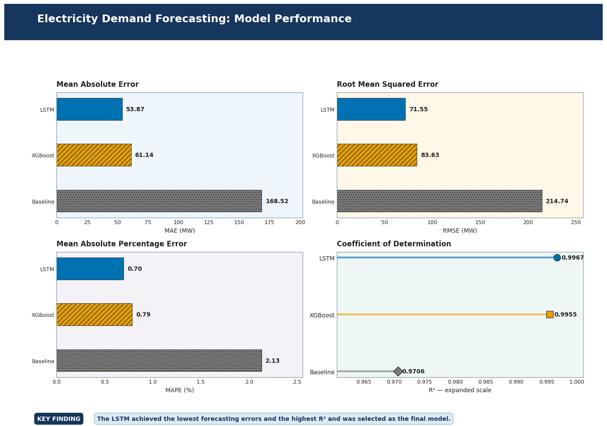
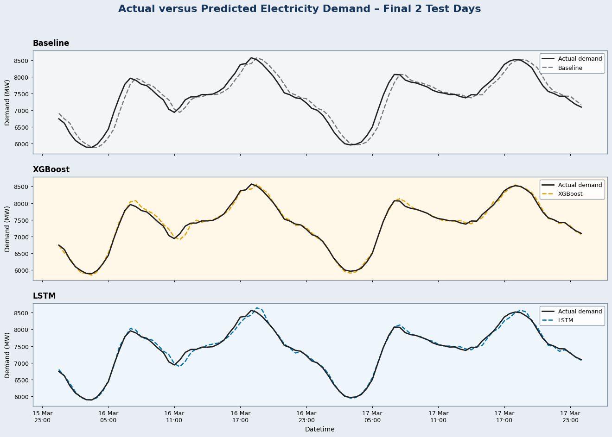
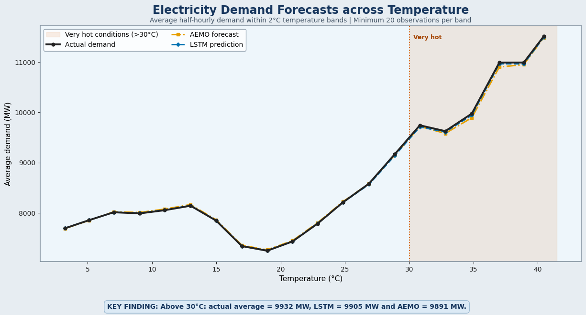

# NSW Electricity Demand Forecasting

### Comparing a persistence baseline, XGBoost and a Hyperband-tuned LSTM for 30-minute-ahead demand forecasting

Electricity demand changes quickly with time of day, recent consumption and weather. In this project, I built an end-to-end forecasting workflow for half-hourly electricity demand in New South Wales and compared three approaches on the same chronological test period.

The **LSTM was the strongest model**, achieving an MAE of **53.87 MW**, an RMSE of **71.55 MW**, a MAPE of **0.70%** and an R² of **0.9967** across **39,235 common test observations**. It reduced RMSE by approximately **14.4%** compared with XGBoost.



## Why I built this

Short-term demand forecasts support electricity-market operations, capacity planning and system reliability. The task becomes especially interesting during extreme heat, when cooling demand increases but very hot observations are relatively scarce.

This portfolio project focuses on four questions:

1. How much value do machine-learning models add over a simple persistence forecast?
2. Can XGBoost capture demand using lagged, calendar and temperature features?
3. Does an LSTM benefit from learning directly from the previous 48 half-hourly observations?
4. Where does the selected model still make errors, particularly during very hot conditions?

## Results

All metrics below were recalculated after joining the three saved prediction files by `DATETIME`. This ensures that every model is evaluated on exactly the same 39,235 observations.

| Model | Observations | MAE (MW) | RMSE (MW) | MAPE | R² |
|---|---:|---:|---:|---:|---:|
| **LSTM** | **39,235** | **53.87** | **71.55** | **0.70%** | **0.9967** |
| XGBoost | 39,235 | 61.14 | 83.63 | 0.79% | 0.9955 |
| Persistence baseline | 39,235 | 168.52 | 214.74 | 2.13% | 0.9706 |

The LSTM reduced:

- MAE by **11.9%** and RMSE by **14.4%** compared with XGBoost.
- MAE by **68.0%** and RMSE by **66.7%** compared with the persistence baseline.

The model comparison and two-day forecast view tell the same story: XGBoost performs well, but the LSTM follows the timing and magnitude of demand more closely. The persistence baseline visibly lags rapid changes.



## Modelling workflow

```text
Raw demand, forecast and temperature data
                    |
                    v
        Cleaning and timestamp alignment
                    |
                    v
       EDA and time-series diagnostics
                    |
                    v
     Chronological 70% / 10% / 20% split
                    |
                    v
   Baseline ------ XGBoost ------ LSTM
                    |
                    v
    Join predictions on common timestamps
                    |
                    v
 Model comparison, residuals and heat analysis
```

### Data preparation

The modelling table combines:

- NSW total electricity demand in MW.
- AEMO pre-dispatch demand forecasts.
- Temperature observations from Bankstown Airport.
- Calendar and time-derived fields.

The data is sorted chronologically and saved as Parquet for efficient reuse. Temperature is aligned to the closest available timestamp. The prepared portfolio dataset covers **January 2010 to March 2021** at half-hourly frequency.

`FORECASTDEMAND` is retained for external comparison only. It is deliberately excluded from the XGBoost and LSTM predictors to avoid duplicating another forecast inside the models.

### Exploratory data analysis

The EDA investigates:

- Demand patterns by hour, day and month.
- Weekday and weekend behaviour.
- The nonlinear relationship between demand and temperature.
- Daily seasonality and autocorrelation across 48 half-hourly periods.
- Demand behaviour during high-temperature conditions.

### Persistence baseline

Three simple forecasts are compared on the validation partition:

- Demand from the previous half hour.
- Demand at the same time on the previous day.
- Demand at the same time in the previous week.

The best validation model is the **previous-half-hour persistence baseline**. It establishes a realistic minimum benchmark for the trained models.

### XGBoost

The XGBoost model uses features designed specifically for tabular forecasting:

- Demand lags covering the previous 48 half hours, two days and one week.
- Shifted rolling means and standard deviations.
- Lagged temperature, temperature change and nonlinear temperature terms.
- Hour, day of week, month and weekend indicators.
- Cyclical sine/cosine encodings for calendar variables.

Early stopping is performed on the validation partition. No test observations are used for feature selection, tuning or stopping decisions.

### LSTM

The LSTM receives a sequence containing the previous **48 half-hourly observations**, representing one complete day of recent history. Each timestep includes historical demand, temperature, nonlinear temperature terms, rolling demand statistics and calendar information.

Input and target scalers are fitted on training data only. A sequence-alignment check confirms that the latest demand value supplied to the network is exactly `t-1`, while the target is demand at `t`.

Keras Hyperband searches the following validation-controlled hyperparameters:

- First and second LSTM-layer units.
- Dropout rate.
- L2 regularisation.
- Adam learning rate.

The test partition remains untouched until the tuned architecture is trained and evaluated.

## Selected model: LSTM

The LSTM was selected because it achieved the lowest MAE, RMSE and MAPE and the highest R² on the common test period. Its average residual was only **0.83 MW**, which is small relative to its MAE of 53.87 MW.

Residuals are generally centred near zero, although the hourly analysis identifies recurring overprediction and underprediction around parts of the daily demand cycle. This is useful operationally: a strong aggregate score does not mean the model is equally accurate at every hour.


## Performance during very hot conditions

Electricity demand generally rises during very hot conditions. Both the LSTM and AEMO forecast follow the average demand-temperature pattern, with the LSTM usually slightly closer to actual demand.

Temperatures above 40°C occur infrequently in Sydney. Predictions at the extreme end should therefore be interpreted cautiously because the model has fewer representative observations from which to learn.



## Repository structure

```text
NSW-Electricity-Demand-Forecasting/
|
|-- notebooks/
|   |-- 01_Data_Prep.ipynb
|   |-- 02_EDA.ipynb
|   |-- 03_Baseline.ipynb
|   |-- 04_XGBoost.ipynb
|   |-- 05_LSTM_Hyperband.ipynb
|   `-- 06_Model_Comparison.ipynb
|
|-- results/
|   |-- model_comparison.csv
|   |-- common_test_predictions.parquet
|   `-- figures/
|       |-- 01_model_performance_comparison.png
|       |-- 02_actual_vs_predicted_all_models.png
|       |-- 03_lstm_residual_analysis.png
|       `-- 04_demand_during_very_hot_conditions.png
|
|-- README.md
|-- requirements.txt
`-- .gitignore
```

## Running the project

The notebooks are designed for Google Colab. The LSTM notebook should be run with a GPU runtime.

1. Create the following folders in Google Drive:

   ```text
   NSW_Electricity_Demand/
   |-- Data/
   |   |-- Raw/
   |   `-- Processed/
   `-- Model Outputs/
   ```

2. Add the raw CSV files to `Data/Raw/`.
3. Run the notebooks in numerical order.
4. Use **Runtime > Change runtime type > GPU** before running the LSTM notebook.
5. The comparison notebook loads saved predictions; it does not retrain the models.

The principal Python packages are:

```text
pandas
numpy
matplotlib
seaborn
scikit-learn
xgboost
tensorflow
keras-tuner
pyarrow
joblib
```

## Data sources

- Electricity demand and pre-dispatch forecast data: [Australian Energy Market Operator - NEM data](https://www.aemo.com.au/energy-systems/electricity/national-electricity-market-nem/data-nem).
- Historical weather observations: [Australian Bureau of Meteorology - Climate Data Online](https://www.bom.gov.au/climate/data/index.shtml).
- Temperature location: Bankstown Airport AWS, station 066137.

Raw data is not included in this repository because of file size and source-data conditions. The data-preparation notebook documents the expected filenames and processing steps.

## Limitations and future work

- Bankstown Airport temperature is used as a proxy for weather across NSW.
- Extreme-temperature observations are scarce, increasing uncertainty above 40°C.
- Rooftop solar generation is not included directly, despite its influence on grid demand.
- The project evaluates one-step, 30-minute-ahead forecasting rather than longer horizons.
- Additional weather variables such as humidity, apparent temperature and heatwave duration may improve extreme-demand forecasts.

Future work could add more years of extreme-weather data, multiple weather stations, rooftop solar generation, probabilistic prediction intervals and a hybrid model that treats historical sequences and known future calendar features separately.

## About this portfolio version

This repository is an independent reconstruction and extension of work I originally explored as part of a university group capstone project.

For this portfolio version, I independently rebuilt the data preparation, exploratory data analysis, persistence baseline, XGBoost model, LSTM sequence model, Hyperband tuning, common-timestamp evaluation, residual analysis and final visualisations. The original group report addressed a broader research problem; the notebooks, experiments and results presented here were recreated for this individual portfolio.

## Tools

Python · Pandas · NumPy · Matplotlib · Seaborn · Scikit-learn · XGBoost · TensorFlow/Keras · Keras Tuner · Google Colab · Git

